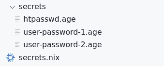
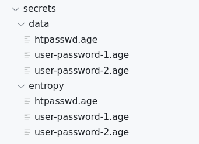

_This post is part of a series where I document ideas I've been developing in my
homelab. You can read the [introductory
post]() for a general overview
of everything._

_Software described here is open source but may not be easy to use outside my
own infra (yet)._

One of the most interesting bits about my Nix monorepo is probably the way I
approach managing secrets. In part because I didn't do my due diligence
reviewing other tools and because I had an idea I wanted to try, I've written my
own tool for this which is what this post is about.

## What is agenix?

This post is already going to be pretty packed so I won't go in-depth about what
agenix is or what it does. Check out the project's
[README](https://github.com/ryantm/agenix?tab=readme-ov-file#agenix---age-encrypted-secrets-for-nixos)
if you don't know know it already. Secrets management in my repo is based on
agenix.

In a normal agenix setup you would probably find a directory structure like
this:



There's a bunch of secrets encrypted using
[age](https://github.com/FiloSottile/age).





Remember, it's pronounced "age" not "age".





Next to them is a `secrets.nix` file. `secrets.nix` associates each secret with
a set of public keys belonging to hosts that should be able to decrypt the
secret.

The secrets stay encrypted throughout build and deploy steps and are finally
decrypted on the target host at activation time.

## How I generate secrets

In my monorepo I've enhanced agenix by building a system around it to generate
the `age` files from a set of (mostly) declarative templates. These templates
are directly integrated into the NixOS configs of my hosts. A single idempotent
command then checks every auto-generated secret and regenerates it if needed.

That system, uhh, does not have a real name right now. The code just refers to
it as "secrets-generator". I'll call it "ASG" in this article (short for "agenix
secrets generator") for lack of a better term.

In practice, this is what I need to add to a host's NixOS config to define a
bunch of secrets:

```nix
{
  x.global.agenix.secrets = {
    user-password-1 = {
      generation.random = {
        length = 72;
      };
    };

    user-password-2 = {
      generation.random = { };
    };

    htpasswd = {
      generation.template = {
        data.myPasswords = [ "user-password-1" "user-password-2" ];
        content = ''
          {{- range .myPasswords -}}
          {{ . }}:{{ hashBcrypt (readSecret .) 10 }}
          {{ end -}}
        '';
      };
    };
  };
}
```

As you can see:

- Secrets are specified as declarative templates.
- There's multiple ways in which a secret can be templated (more on that later).
- Secrets can have dependencies on other secrets.
  - The `readSecret` function reads the contents of another secret.
  - Dependencies do not need to be declared upfront.
  - Ordering is done automatically, so a `readSecret` call will never return a
    stale value if the secret to be read needs to be regenerated.

We can generate the `age` files for these secrets with a single command:

```sh
just generate-secrets
```





[just](https://github.com/casey/just) is a command runner. Think Make but every
target is `.PHONY` which is probably how most people use Make nowadays.





This would generate a bunch of files:



Files in the `data` directory are picked up by agenix and included in the host's
NixOS config. These are the actual agenix secrets.

Files in the `entropy` directory are needed by the generator. (We'll see why in
just a bit.)

If we changed a parameter for one of the passwords now &mdash; for example
setting the length of the first password to 64 &mdash; then ASG would generate a
new password and regenerate the htpasswd file. Both the "data" and "entropy"
files for those secrets would be modified.

## Deterministic templating

The trick behind ASG's approach to change detection is that generating a secret
(in most supported templating engines) is a deterministic process that can be
replayed given a static source of randomness.

The generator makes use of that by recording all bytes of entropy that it reads
from the system's randomness source while generating a secret. On subsequent
runs it first renders the template again with the previously recorded random
bytes.

If the output is different from the currently stored secret or the generator
runs out of random bytes before completing the template, the secret is out of
date and needs to be regenerated. If the template renders successfully and
produces the same output as the existing (decrypted) secret, the secret is fine.

When regenerating a secret, the previously recorded entropy is discarded and the
template is rendered using the system's cryptographic randomness source again.

Files in the `entropy` directory hold the recorded entropy and are always
encrypted with a set of admin keys. Every secret can be decrypted using those
admin keys, which is necessary for ASG to check if a secret is stale and to
provide the `readSecret` function.

Actually encrypting the secret into an age file happens transparently below the
templating engine. age encryption is not deterministic in ASG.





One downside with this approach is that any bug that makes the generator
nondeterministic causes inexplicable regeneration of secrets.





I ran into a fun issue once where I was getting just that: Occasionally some
JSON secrets changed in Git without a clear reason why. The structure didn't
change but some Bcrypt hashes were clearly regenerated.

Turns out I was iterating over the keys in a map at some point and transforming
the corresponding value to interpret function calls like `hashBcrypt`. Iterating
a map in Go does not guarantee any particular order of keys. That alone wouldn't
be a problem but some functions have a sneaky side effect: They consume entropy.
So if you replayed iterating over a map, keys might be processed in a different
order and `hashBcrypt` might read a different section of the recorded entropy
stream leading to a differently salted hash.





Not gonna lie, this was actually fun to solve though! If you're into this sorta
stuff I can highly recommend this old Strangeloop talk about deterministic
simulation testing at FoundationDB:
["Testing Distributed Systems w/ Deterministic Simulation" by Will Wilson](https://www.youtube.com/watch?v=4fFDFbi3toc).





## Supported templating methods

ASG currently supports four different methods for generating secrets. Three of
those are integrated templating engines that support deterministic replays.

### Random strings

A simple random string with a defined length and some options to control the
charset.

```nix
{
  x.global.agenix.secrets = {
    user-password = {
      generation.random = {
        length = 32;
        charset.special = false;
      };
    };
}
```

Note that this is also a deterministic template! Change a password's
requirements and your password is updated automatically.

### Text templates

Arbitrary text files can be written as Go templates (using the `text/template`
engine from the standard library).

Templates are provided with a library of functions for dynamically processing
values. Those are useful for reading other secrets and doing stuff with them
(like hashing passwords) but the set of functions is very limited right now
since I've only implemented what I needed for myself.

Parameters can be passed to a template with the `data` option, in the form of an
attribute set.

```nix
{
  x.global.agenix.secrets = {
    htpasswd = {
      generation.template = {
        data = {
          usernames = [ "alice" "bob" ];
          comment = "Generated for ${config.networking.hostName}";
        };

        content = ''
          # {{ .comment }}

          {{- range .usernames -}}
          {{ . }}:{{ hashBcrypt (readSecret (fmt "user-passwords/%s" .)) 10 }}
          {{ end -}}
        '';
      };
    };
  };
}
```

### JSON templates

JSON templates are functionally the same as text templates but they can only
produce minified JSON output. The big gain here is that the template is defined
as a plain old Nix value (most likely a list or an attribute set).





Seriously this is really cool! Writing a JSON secret feels super natural next to
the surrounding NixOS config. It's like you're just setting an option but in a
secret.

It would be a lot more awkward if I had to use text templates for generating
JSON.





The template is first converted to JSON before being sent off to the generator.
Function calls (like `readSecret`) are encoded as JSON objects with special
keys. To render the template, the generator just walks the template data
structure recursively, executing any function call it finds and replacing it
with the return value.

There's no need for parameters in this engine since you can freely mix regular
Nix expressions into the template.

```nix
{
  x.global.agenix.secrets = {
    password-hashes = {
      generation.json.content = { jsonLib, ... }: {
        hostname = config.networking.hostName;
        users = lib.map
          (username: {
            name = username;
            password = jsonLib.hashBcrypt (jsonLib.readSecret "user-passwords/${username}") 10;
          })
          [ "alice" "bob" ];
      };
    };
  };
}
```

The output of that template would look like this, except minified:

```json
{
  "hostname": "cv01",
  "users": [
    {
      "name": "alice",
      "password": "$2a$05$JzsIiVID2eC0O0W1yKhhr.Qlgy4oZEGsZ16zCLH0KvB0O7sNM0NGa"
    },
    {
      "name": "bob",
      "password": "$2a$05$9Vr6..nrh1kT3.riLFdQae49FzlFxgt8/0uavlJFRkY8HHT4jY78."
    }
  ]
}
```

### Generator scripts

They make up a minority of secrets in my config but sometimes it's still useful
to generate a secret using a simple script instead of a template.

ASG also supports that and this is what it looks like:

```nix
{
  x.global.agenix.secrets = {
    "authelia/jwk-private-key" = {
      generation.script = {
        runtimeInputs = pkgs: with pkgs; [ authelia coreutils ];
        script = ''
          cd "$TMP_DIR"
          authelia crypto certificate rsa generate >&2
          cat private.crt
        '';
      };
  };
}
```

The options are not unlike what you would pass to `pkgs.writeShellApplication`:
a Bash script and some packages to be added to the script's PATH. As a quality
of life improvement, some boilerplate is added to the script automatically
(creating a temporary directory and defining some variables).

Secrets are generated on development machines (or _maybe_ in CI) and those might
have a different architecture or OS than the target host where a secret is
defined. Therefore, we can't simply use the host's package set in
`runtimeInputs` and we have to resort to defining `runtimeInputs` as a function.
When ASG is invoked, the function is called with the package set of the host
where ASG is running.

Generating a secret by script cannot be replayed deterministically so no entropy
file is created for those secrets.





Well, maybe it _could_ be made deterministic but I'm not
[Antithesis](https://www.antithesis.com/).





XOXO btw, their stuff got me super hyped about deterministic simulation testing
and probably inspired this thingy.





Secrets generated by script are currently only regenerated if their age file is
missing. In addition to that, dependencies on other secrets are not supported.
Both of those things could probably be changed (by tracking when dependencies
change and regenerating based on that) although I hadn't encountered the need
for it yet.

## To be continued...

Aaaand... this is where I'm gonna cut it I think. This post is already pretty
long and adding more would explode both of our brains.

But there's more you can look forward to! Part 2 will cover:

- Why I have separate options for defining secrets and defining where they're
  used
- How ASG can be used across hosts and for arbitrary non-NixOS configs
- A comparison with agenix-rekey
- A brief tour of the code with links to relevant files in my monorepo
- How usable this is right now and future plans

For now, cya! Happy agenixing.
