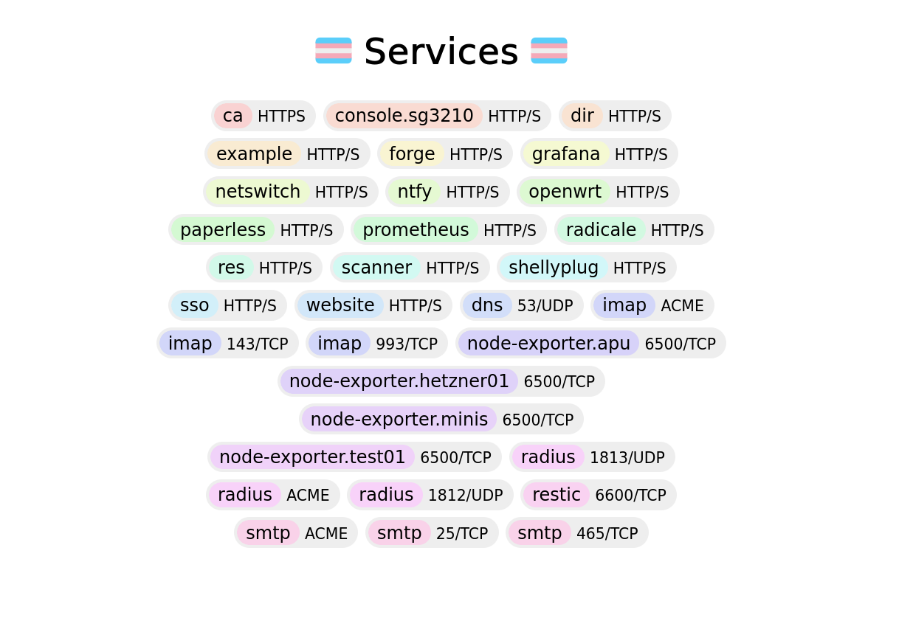

This article is the first in a series about stuff I've developed for my homelab.
I'm mostly writing this as a braindump for my future self but it might be useful
to others as well. Feel free to use ideas and code from this as you see fit.

This post in particular will just be a high-level overview of what we're talking
about and some cherry-picked highlights of what makes it interesting. Oh and at
the end I'll touch on the status quo of the project.



Side note: When I say braindump I mean it. I hope it'll be comprehensible enough
to outsiders to be useful but if not I appreciate any feedback.

Other side note: This kind of box is for **side notes**. It can be freely
ignored while skimming but it might have some useful context or witty
commentary.



## Why should you care?

The best way to illustrate what I want from my Nix config is to explain the
"grand vision" I think and then break it down.

Essentially, the goal is to have:

- A **monorepo** of all of the software I've made for myself
  - No matter if it's for a server, laptop, phone, etc.
- And all of the config that defines **everything in my infrastructure**
  - NixOS and non-NixOS systems
- I want to be able to integrate things tightly. **Everything is connected in
  Nix.**
- I want to abstract over common patterns and automate repetitive tasks.
- Everything should be **built in a single step** and **deployed in a single
  step**.
  - This doesn't mean it shouldn't be possible to build things in isolation of
    course.

Essentially, the goal is to have a single place to develop everything that
allows me to tightly "glue stuff together" with Nix. And I think I'm part of the
way there:

- I have a monorepo and the software I've written over the last 1-2 years is
  pretty much all in there. (Except for completely separate things like this
  website.)
- Currently there is one build/deploy step per host because I haven't found or
  implemented deployment tooling the way I want it yet.
- Stuff is pretty tightly integrated: Hosts can share configuration among each
  other by setting options in a "global namespace". Option values defined in
  this space are replicated across all hosts.
- High-level abstractions and automation are pretty pervasive throughout the
  repo.
- No non-NixOS hosts are part of the repo yet but I'm confident the following
  things I'm using could be integrated:
  - My OpenWrt router config
  - That one TP-Link switch I have which has a CLI
  - Tailscale ACLs
  - Kubernetes
  - macOS via nix-darwin and/or home-manager

## Cute lil' highlights

To achieve all of this I've cast a few magic spells. I'll try to write about
everything I think is worth documenting but here's an executive summary of the
most important ideas.

### Globalmods

Essentially "globalmods" are Nix modules whose options live in a global
"namespace". I.e. values defined on one host are automagically visible on all
hosts.

For example I can just write:

```nix
{
  x.global.email.accounts = {
      "paperless@systems.tbx.at" = {
          permissions.receive = true;
      };
  };
}
```

Which is essentially saying "to whom it may concern, I want an email account".
Then I can consume that definition in the module that sets up my email server,
even if that's on a different host than where the email account was requested.

This is _really neat_ since it allows me to collocate logically related config
in a single module instead of moving it out into a central file where all email
accounts are defined (for example). The downside is that it might slow down
evaluation but I trust in the future of Tvix (or better evaluation caching).

### Agenix secrets generation

Secrets (when using agenix or a similar tool) are normally opaque blobs that you
commit into your repository and hopefully document how to recreate. I've
completely automated that. (Almost) all of my secrets have a declarative
specification attached that describes how they're generated.

```nix
{
  x.global.agenix.secrets = {
    "radicale/htpasswd" = {
        generation.template = {
            data.users = [ "alice" "bob" ];
            content = ''
                {{- range .users -}}
                {{ . }}:{{ hashBcrypt (readSecret (fmt "radicale/passwords/%s" .)) 10 }}
                {{ end -}}
            '';
        };
    };
  };
}
```

My generator heavily relies on declarative templates instead of scripts to
generate secrets. That makes it possible to **deterministically replay
templating** for a secret given a stream of bytes to use whenever randomness is
required.

In practice that means secrets generation is a single idempotent command that
will finish with all secrets up to date and up to spec. I don't have to think
about secrets anymore and they're perfectly documented.

Oh and JSON can be templated using plain Nix data structures because generating
structured data with text templates is _✨ awful ✨_ (see: Helm).

### Static "service discovery"

I hate relying on copy/pasting URLs to connect different services in my infra.

Therefore I've written a globalmod (vertical integration, yeah! yeah!) that
provides a central place where modules can say "this host provides a network
service called bar on these ports called http and https". And then other
modules, possibly on other hosts, can say:

```nix
{
  services.foo.peerURL = "http://${globalConfig.netsrv.services.bar.fqdn}";
}
```

Some cool benefits you gain for free with something like that:

- You can move services between hosts without fear.
- Stuff instantly explodes in your face if you reference a service that doesn't
  exist.
- You can automate firewall rules and DNS zone files with this.
  - And remember, globalmods span across hosts, so this also works for services
    not running on the same server as your authoritative DNS.
- You can generate beautiful internal landing pages like this one:



This idea is kinda sorta a little bit stolen from Kubernetes' `Service`
resource.

## Other stuff

Those are approximately the biggest flashiest features I've implemented now.
Each of them is gonna get a dedicated writeup where I go in depth about how it
works and how it's implemented. But there's also a couple other things that
might be worth documenting:

- How I've streamlined adding modules, packages, and package dev shells in my
  flake
- Generally my flake-parts setup because that wasn't super straightforward to
  learn
- A flake-parts module for writing [Justfiles](https://github.com/casey/just) in
  Nix (kinda opinionated though so YMMV)
- A neat little hack for building Go modules while referencing libraries locally
  in the repo
- Some of the services making use of globalmods (OIDC, Email, Prometheus scrape
  targets, Restic backup repositories, ...)
- Other services that I've added weird hacks to
- Perhaps also how I've automated provisioning of local VMs on top of libvirt
  and VPSes on Hetzner (thought that's admittedly an awful hackjob)

## Current status and what's next

I'm currently working on publishing a sanitized version of my monorepo (removing
encrypted secrets just to be extra-sure as well as some files that can't be
included for copyright or other reasons). The structure of that repo will be
explained across subsequent posts to keep the amount of information in each post
bite-sized.

Truthfully, there haven't been any big developments in this project over the
last few months. This is in part due to me needing a break from this project and
life also had some other things for me in store.

Also, let's just say 2024 wasn't exactly a year that strengthened my enthusiasm
for Nix. I used to have a section commenting on the community controversies here
but it felt off, so I removed it. I'm just gonna say I want Nix to be a
radically welcoming space for marginalized groups in tech (like women, queer
people, and neurodivergent folks, among others) and I'm hoping I can help move
it into that direction at least a little bit.



If you're interested in anything I've described in this post, I'd be thrilled to
hear from you! Right now I don't have concrete plans to split anything out of my
monorepo and turn it into its own community project but if there's interest in
that, we can definitely do it. Just shoot me a message using any of the contact
methods below. 😊
