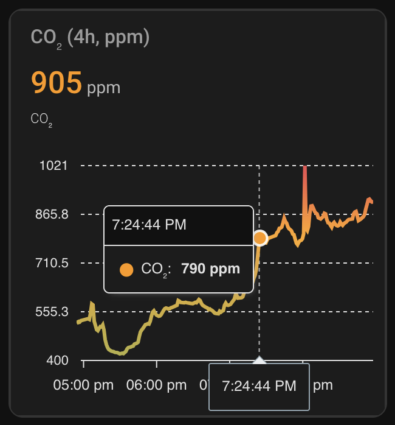

I'm testing the accuracy of an IKEA Alpstuga device (bought 2026-01-29) against
an AirGradient ONE (version 9 of the DIY kit). I don't have the Alpstuga hooked
up to any Matter controller so I'm just collecting point-in-time readings.

The Alpstuga is placed on a table in the room while the AirGradient is attached
to a wall about 10m away.

My testing methods aren't scientifically accurate BUT I just wanted to see for
myself how the Alpstuga compares to a more renowned device because I've seen
differing reports on its accuracy online.

## Sensors and margin of error

Sensiron has
[confirmed](https://sensirion.com/company/news/press-releases-and-news/article/sensirion-inside-ikea-alpstuga-smart-air-quality-sensor)
that the Alpstuga uses their **SEN63C** sensor module which, according to spec
promises the following accuracies:

- CO2: **±(100ppm + 10% of the reading value)**
- PM2.5: **±10%**

According to the Alpstuga manual it can take up to 12 hours for the sensor to be
fully calibrated for CO2 readings.

In comparison, the AirGradient ONE uses a combination of sensors:

- CO2 is measured by the **Senseair S88** at **±(40ppm + 3% r.v.)**
- PM2.5 is measured by the **Plantower PMS5003** at **±10µg/m³** for
  readings 0-100µg/m³

## One hour in

After about an hour here's how the measurements compare. Note that the
**CO2 should not be considered valid yet.**

| Device      | CO2 | PM2.5 | Temp (°C) | Rel. Humidity |
| ----------- | -------------- | ---------------- | --------- | ------------- |
| Alpstuga    | 399ppm         | 9μg/m³           | 20.9      | 34%           |
| AirGradient | 667ppm         | 2.4μg/m³         | 22.7      | 31.9%         |

The actual possible values according to each device's measurement compare as
follows:

| Sensor           | Range Alp. | Range AG    | Aggreement within error? |
| ---------------- | ---------- | ----------- | ------------------------ |
| CO2   | 259-539ppm | 600-734ppm  | ❌                       |
| PM2.5 | 8-10μg/m³  | 0-12.4μg/m³ | ✅                       |





Temperature measurements could conceivably be a bit different, since the
AirGradient is mounted higher up and in proximity to other electronics.

This can also cause the discrepancy in relative humidity values.





## Two hours in

...it's looking much better.

| Device      | CO2 | PM2.5 | Temp (°C) | Rel. Humidity |
| ----------- | -------------- | ---------------- | --------- | ------------- |
| Alpstuga    | 503ppm         | 3μg/m³           | 21.0      | 34%           |
| AirGradient | 666ppm         | 0.7μg/m³         | 22.6      | 32.1%         |

Both the CO2 and the PM2.5 are now closer to the
AirGradient's measurements and, adjusting for margins of error, they are
actually in agreement!

| Sensor           | Range Alp.   | Range AG    | Aggreement within error? |
| ---------------- | ------------ | ----------- | ------------------------ |
| CO2   | 353-653ppm   | 606-726ppm  | ✅                       |
| PM2.5 | 2.7-3.3μg/m³ | 0-10.7μg/m³ | ✅                       |

The Alpstuga still seems to report a bit low but as a general guideline of "Is
it bad enough that I should open a window?" I would consider this okay right
now.





I had the Alpstuga unplugged for a few seconds about 10 minutes before taking
this measurement.

It seems like it started off at a default value of 390ppm for CO2 at
first but the sensor seems to have kept its calibration since it jumped up to
500 much quicker than after first plugging it in. The general trend in the next
few minutes followed the AirGradient's readings.





Funnily enough it lost its clock settings.





It remains to be seen how the Alpstuga holds up after its calibration is
officially done.

## Three and a half hours in

The CO2 measurements are in disagreement again.

| Device      | CO2 | PM2.5 | Temp (°C) | Rel. Humidity |
| ----------- | -------------- | ---------------- | --------- | ------------- |
| Alpstuga    | 424ppm         | 4μg/m³           | 21.0      | 33%           |
| AirGradient | 630ppm         | 0.5μg/m³         | 22.6      | 31.5%         |

It was fluctuating a bit around this time but 420-ish ppm seemed to be the
"baseline" it usually returned to. I've moved the Alpstuga around a little bit,
maybe that upset it.

| Sensor           | Range Alp.   | Range AG    | Aggreement within error? |
| ---------------- | ------------ | ----------- | ------------------------ |
| CO2   | 282-566ppm   | 571-689ppm  | ❌                       |
| PM2.5 | 3.6-4.4μg/m³ | 0-10.5μg/m³ | ✅                       |

This was the last reading I took before leaving for the day.

## The next day (15:10, about 15 hours after the last reading)

As far as I know, the Alpstuga was powered overnight, so this is the first
reading after the 12-hour calibration period. The readings of its CO2
sensor can now be considered valid.

The Alpstuga seems to be reading CO2 levels above the AirGradient's
measured concentration now.

| Device      | CO2 | PM2.5 | Temp (°C) | Rel. Humidity |
| ----------- | -------------- | ---------------- | --------- | ------------- |
| Alpstuga    | 662ppm         | 12μg/m³          | 20.7      | 31%           |
| AirGradient | 580ppm         | 20.1μg/m³        | 23.4      | 28.1%         |

When adjusted for margin of error, there is now again an overlap in possible
actual values determined by the Alpstuga and the AirGradient.

| Sensor           | Range Alp.     | Range AG       | Aggreement within error? |
| ---------------- | -------------- | -------------- | ------------------------ |
| CO2   | 496-828.2ppm   | 523-637ppm     | ✅                       |
| PM2.5 | 10.8-13.2μg/m³ | 10.1-30.1μg/m³ | ✅                       |

## The next day (17:15)

| Device      | CO2 | PM2.5 | Temp (°C) | Rel. Humidity |
| ----------- | -------------- | ---------------- | --------- | ------------- |
| Alpstuga    | 593ppm         | 15μg/m³          | 21.0      | 29%           |
| AirGradient | 495ppm         | 10.8μg/m³        | 22.8      | 26.8%         |

Still in agreement.

| Sensor           | Range Alp.     | Range AG      | Aggreement within error? |
| ---------------- | -------------- | ------------- | ------------------------ |
| CO2   | 434-752ppm     | 523-637ppm    | ✅                       |
| PM2.5 | 13.5-16.5μg/m³ | 0.8-20.8μg/m³ | ✅                       |

## After airing the room out (17:39)

| Device      | CO2 | PM2.5 | Temp (°C) | Rel. Humidity |
| ----------- | -------------- | ---------------- | --------- | ------------- |
| Alpstuga    | 423ppm         | 16μg/m³          | 14.9      | 37%           |
| AirGradient | 443ppm         | 9.2μg/m³         | 18.5      | 30.6%         |

| Sensor           | Range Alp.     | Range AG    | Aggreement within error? |
| ---------------- | -------------- | ----------- | ------------------------ |
| CO2   | 281-565ppm     | 390-496ppm  | ✅                       |
| PM2.5 | 14.4-17.6μg/m³ | 0-19.2μg/m³ | ✅                       |

## 19:18

This one is noteworthy because the sensors actually disagreed for the first time
after calibration.

The Alpstuga had people sitting and talking around it at approximately this time
but the discrepancy is still somewhat extreme.

Another possible explanation is that the AirGradient metrics are actually an
average over time and the CO2 content has increased in a relatively
short timespan. I haven't checked how the AirGradient's numbers are processed in
the dashboard I took them from.

| Device      | CO2 | PM2.5 | Temp (°C) | Rel. Humidity |
| ----------- | -------------- | ---------------- | --------- | ------------- |
| Alpstuga    | 929ppm         | 9μg/m³           | 19.9      | 33%           |
| AirGradient | 644ppm         | 5.8μg/m³         | 21.7      | 29.9%         |

| Sensor           | Range Alp.    | Range AG    | Aggreement within error? |
| ---------------- | ------------- | ----------- | ------------------------ |
| CO2   | 736-1122ppm   | 584-703ppm  | ❌                       |
| PM2.5 | 8.1-10.9μg/m³ | 0-15.8μg/m³ | ✅                       |

The AirGradient's concentration did increase by about 260ppm just a few minutes
afterwards, so badly mixed air or a running average sound plausible.

## 20:06

| Device      | CO2 | PM2.5 | Temp (°C) | Rel. Humidity |
| ----------- | -------------- | ---------------- | --------- | ------------- |
| Alpstuga    | 1014ppm        | 9μg/m³           | 21.6      | 31%           |
| AirGradient | 892ppm         | 18.2μg/m³        | 23.1      | 29.8%         |

| Sensor           | Range Alp.    | Range AG      | Aggreement within error? |
| ---------------- | ------------- | ------------- | ------------------------ |
| CO2   | 813-1215ppm   | 825-959ppm    | ✅                       |
| PM2.5 | 8.1-10.9μg/m³ | 8.2-28.2μg/m³ | ✅                       |

_I'll be updating this post as I capture more readings._
